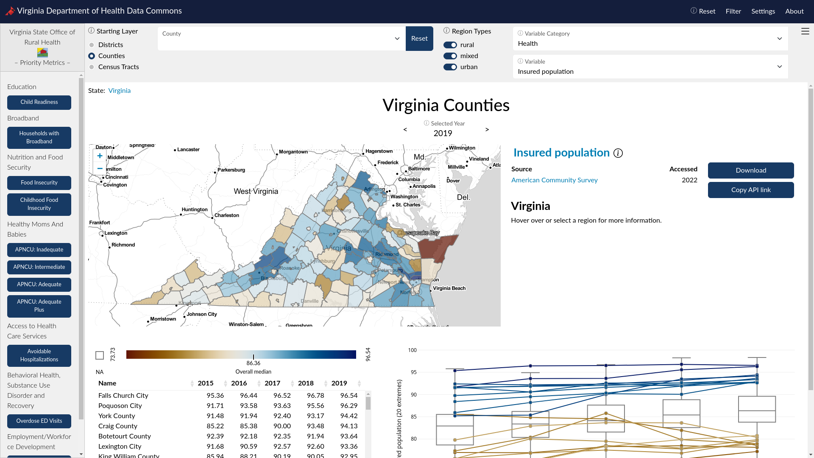
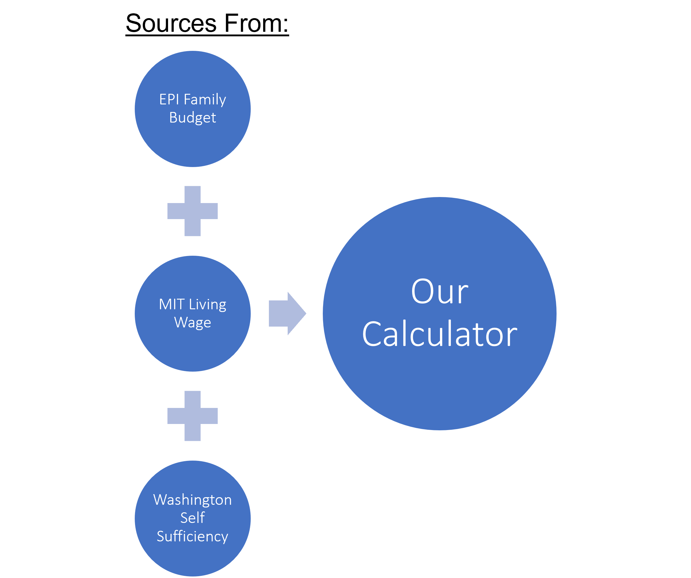
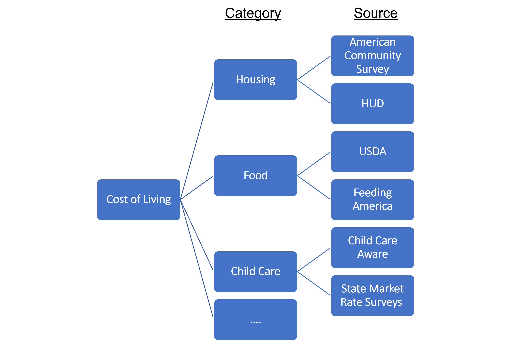
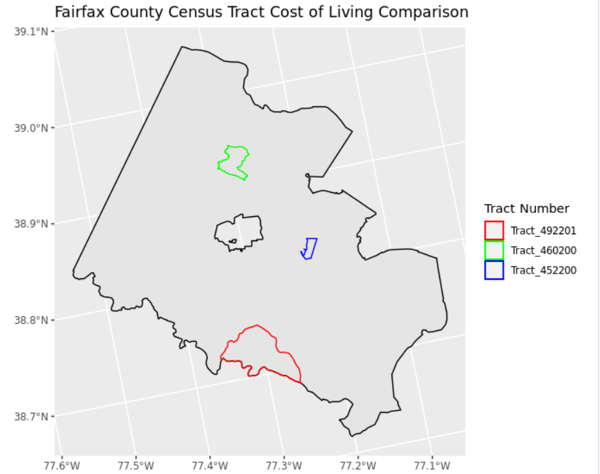

## Stakeholder(s)
- MasterCard Center for Inclusive Growth ([MasterCard Center](https://www.mastercardcenter.org/))
- Virginia Department of Health ([VDH](https://www.vdh.virginia.gov/))
- Fairfax County Countywide Data Analytics Unit ([CDA](https://www.fairfaxcounty.gov/data/))

## What is a Data Commons?
Data commons is an open knowledge repository that co-locates data from a variety of sources, builds and curates data insights, and provides tools designed to track issues over time and geography allowing governments and community stakeholders to learn continuously from their own data.

The Social and Decision Analytics Division has already deployed several data commons to empower policymakers with easy access to data analysis and visualizations. One example is the [Virginia Department of Health Data Commons](https://uva-bi-sdad.github.io/vdh_rural_health_site/).

Local communities have data on policies, strategies, events, and social behaviors but often lack the analytical tools to use their valuable data. Partnering with the **Mastercard Center for Inclusive Growth**, we hope to equip local communities in the National Capital Region with easy access to analytical tools like this to drive policy and strategy development.

## Cost of Living Calculator

One important section of our data commons is the proportion of households at risk of food insecurity in each region. To make a reliable estimation of households at risk, we need a trustworthy calculator for the cost of living in each corresponding region. A cost-of-living adjustment is important because it allows employees, retirees and people living on fixed incomes to afford housing, goods, services and taxes as prices increase over time.The cost of living is often used to compare how expensive it is to live in one city versus another. To account for sub-county level variations in cost of living, the geographic resolution we target is at census-tract level. According to the [U.S. Census Bureau](https://www.census.gov/programs-surveys/geography/about/glossary.html#par_textimage_13), a census tract is 

### Comparisons of Existing Calculators
We started our process by comparing three existing cost of living calculators:

- [Economic Policy Institute (EPI) Family Budget Calculator](https://www.epi.org/resources/budget/)
- [MIT Living Wage Calculator](https://livingwage.mit.edu/)
- [University of Washington Self Sufficiency Standard Calculator](https://selfsufficiencystandard.org/calculator/)

We analyzed data sources in each calculator and conducted comparative studies in each category. Among them, the methodology of the Washington Self Sufficiency Standard calculator was deemed the most suitable for our project. Nevertheless, it does not provide down to census-tract level numbers and has some data sources outdated. Therefore, after a series of evaluation, we concluded that if we want a precise estimate of the cost of living at census tract level, we would have to adopt some of their proposed sources and compile our own calculator.

    

        
    

    

        
    

### Our Sources

There are various categories that a calculator have to take into consideration for estimating the cost of living in a particular area. We identified 7 key components for the cost of living: food, housing, transportation, child care, health care, other necessities (miscellaneous), and tax (including tax credits). After weeks of comparing the pros and cons of different sources and approaches to estimate, we come up with the following table that shows the **Methodology Summary** of our proposed Cost of Living Calculator.

| Category       | Description                                                  | Source                                 | Geo resolution |
| -------------- | ------------------------------------------------------------ | -------------------------------------- | -------------- |
| Food           | USDA low-cost plan in May 2022, adjusted for regional variation by Feeding America Map the Meal Gap per-meal cost data 2020. | USDA, Feeding America                  | County         |
| Housing        | HUD Fair Market Rates from FY21-22 (40th Percentile), then adjusted by housing inflation index for past fiscal year (5,8% for housing). | HUD, BLS                               | ZIP            |
| Transportation | Estimation based on three components: auto ownership, auto use, and transit use. It uses information from ACS (means of transportation to work, vehicles at home) | Centre for Neighborhood Technology     | Tract          |
| Child Care     | Market-rate costs from the 75th percentile and estimated by the Virginia Department of Social Services, by categories: age, geography and type of facility. | Virginia Department of Social Services | County         |
| Medical        | Acquire through UWashington-SSS calculator: state-level premium from Medical Expenditure Panel Survey (MEPS), mapped to county level by HHS Qualified Health Plan Marketplace price. MEPS  data for state-wise out-of-pocket expenses | MEPS, HHS                              | County         |
| Miscellaneous  | Validated with the  Consumer Expenditure Survey data, we estimate other expenses as 10% of  spending on other necessities. Other figures: National Research Council, 15% -25% of cost on food and shelter. | 10% of of others                       | Tract          |
| Tax            | Taxes include federal and state income tax, payroll taxes (Social Security), and state and local sales taxes where applicable. | IRS, VA Dept. Taxation                 | County         |
| Credit         | Federal tax credits including the Earned Income Tax Credit, the Child and Dependent Care Tax Credit, and the Child Tax Credit and applicable state tax credits | IRS, VA Dept. Taxation                 | County         |

### Examples from Fairfax County, VA

We took three census tracts from the Fairfax county, VA and estimated the cost of living for household in these tracts. The calculations are based on prior assumption of household composition and accounts for household size from 1 to 7 or more, represented as "HH1" to "HH7".

| Annual cost of living              | HH1     | HH2     | HH3      | HH4      | HH5      | HH6      | HH7      |
| ---------------------------------- | ------- | ------- | -------- | -------- | -------- | -------- | -------- |
| 51.059.4922.01                     | $51,532 | $83,456 | $117,473 | $150,888 | $172,162 | $186,675 | $199,703 |
| 51.059.4602.00                     | $53,059 | $84,839 | $118,996 | $152,760 | $174,383 | $188,891 | $202,483 |
| 51.059.4522.00                     | $44,536 | $75,056 | $108,654 | $141,301 | $161,807 | $174,637 | $187,672 |
| UWashington-SSS for Fairfax County | $42,720 | $71,076 | $103,488 | $134,508 | $152,052 | $161,718 | $178,704 |

## Application with Food Insecurity

We use the cost of living calculator to estimate the number of households facing food insecurity or in risk of food insecurity in each census tract. We take the size of household as a independent variable for estimating the cost of living, and compare the cost to their income category to determine the risk.

### Iterative Proportional Fitting (IPF)

For privacy considerations, the Census Bureau only provides the aggregated figures at the census tract level, so from the American Community Survey (ACS), we can only retrieve the total number households in size and the total number of households in each income bracket, not a two-way table of the detailed composition. The following is an example of census tract 51.059.4922.01 in Fairfax County, VA: we can only retrieve the aggregated margins, and what's in the middle cells is missing.
| Household size | HH1  | HH2  | HH3  | HH4  | HH5  | HH6  | HH7  | TOTAL |
| ------------------ | ---- | ---- | ---- | ---- | ---- | ---- | ---- | ----- |
| Household number      | 986  | 384  | 309  | 113  | 67   | 20   | 27   | 1906  |

|       | Less than $10,000 | $10,000 to $14,999 | $15,000 to $24,999 | $25,000 to $34,999 | $35,000 to $49,999 | $50,000 to $74,999 | $75,000 to $99,999 | $100,000 to $149,999 | $150,000 to $199,999 | $200,000 or more | TOTAL |
| ----- | ----------------- | ------------------ | ------------------ | ------------------ | ------------------ | ------------------ | ------------------ | -------------------- | -------------------- | ---------------- | ----- |
| TOTAL | 91                | 11                 | 13                 | 11                 | 82                 | 23                 | 101                | 205                  | 326                  | 1043             | 1906  |

We use iterative proportional fitting (IPF) to estimate each cell and expand the two margins into a two-way table. IPF, a.k.a. RAS Algorithm in econometrics, makes an educated guess on the bivariate joint distribution. It starts with a presumed distribution, known as the seed, and proceeds to fit the aggregated margins. The choice of seed has a significant impact on the accuracy of the guess, so for each census tract, we use the ground-truth distribution of the PUMA they belong to as the seed.

A PUMA, or Public Use Microdata Area, is the aggregation of numerous census tracts that contains a total population of at least 100,000. In this much larger population, it is safer for the Census Bureau to release detailed data on the distribution within. This gives us an approximation of pattern of the two-way table in real life, and becomes our starting seed for IPF algorithm. For example, according to the [relationship file](https://www.census.gov/programs-surveys/geography/guidance/geo-areas/pumas.html), the census tract 51.059.4922.01 is part of PUMA 59304, so we use the two-way table of PUMA 59304 as seed and the margins of 51.059.4922.01 as raw data for IPF, and estimated the detailed distribution.

| Household size       | HH1  | HH2  | HH3  | HH4  | HH5  | HH6  | HH7  | TOTAL |
| -------------------- | ---- | ---- | ---- | ---- | ---- | ---- | ---- | ----- |
| Less than $10,000    | 72   | 12   | 7    | 0    | 0    | 0    | 0    | 91    |
| $10,000 to $14,999   | 10   | 0    | 1    | 0    | 0    | 0    | 0    | 11    |
| $15,000 to $24,999   | 10   | 2    | 0    | 0    | 0    | 1    | 0    | 13    |
| $25,000 to $34,999   | 10   | 1    | 0    | 0    | 0    | 0    | 0    | 11    |
| $35,000 to $49,999   | 74   | 2    | 2    | 2    | 2    | 0    | 0    | 82    |
| $50,000 to $74,999   | 18   | 2    | 2    | 0    | 1    | 0    | 0    | 23    |
| $75,000 to $99,999   | 66   | 7    | 13   | 5    | 5    | 5    | 0    | 101   |
| $100,000 to $149,999 | 125  | 38   | 19   | 10   | 3    | 5    | 5    | 205   |
| $150,000 to $199,999 | 186  | 69   | 42   | 12   | 4    | 9    | 4    | 326   |
| $200,000 or more     | 415  | 251  | 223  | 84   | 52   | 0    | 18   | 1043  |
| TOTAL                | 986  | 384  | 309  | 113  | 67   | 20   | 27   | 1906  |

### Real-world Examples

Combining the IPF result and the cost of living calculated in previous section, we can estimate the proportion of households facing or at risk of food insecurity in each census tract. To continue with the example of census tract 51.059.4922.01, in which the cost of living is

| Household size     | HH1    | HH2    | HH3     | HH4     | HH5     | HH6     | HH7     |
| ------------------ | ------ | ------ | ------- | ------- | ------- | ------- | ------- |
| Annual cost in USD | 51,532 | 83,456 | 117,473 | 150,888 | 172,162 | 186,675 | 199,703 |

We consider all households of size 1 making less than \$49,999 a year as food insecure, and in need of government help, and since \$51,532 falls in the category of \$50,000 to \$74,999, we consider households in this category as in risk of food insecurity. In this way, we reach the following table as the conclusion of food insecurity estimations for census tract 51.059.4922.01.
| Status of insecurity | count | percentage |
| ------------------------ | ---- | ---- |
| Food Insecure HH         | 264  | 14%  |
| Food Insecure plus At-Risk HH | 337  | 18%  |
| No Food Insecure HH      | 1569 | 82%  |
| Total                    | 1906 | 100% |
## Evaluation of results
By pulling data from more granular sources than implemented by prior calculators, we created a calculator in which the cost of living varies not only across counties but across census tracts. Specifically, we found information for transportation and housing that was more granular than what was being implemented in all other calculators, giving our calculator an edge, especially in larger counties. A caveat to these results is that we could not find tract-level data for specific categories, such as food and healthcare. However, we deemed it unlikely that these were as variable across a county as other variables may be. Using these results, we could pinpoint the income bracket(s) at which households may become food insecure in a given tract. This method, along with PUMA data, has allowed for more detailed evaluations of the amount of food insecure households in an area, an essential metric for local governments when determining how to allocate funding.

## Open Street Routing Machine
To improve our routing calculations, we also made updates to our infrastructure. For posterity, we include the project on a separate page [here](https://yaoeh.github.io/dspg22/dc_osrm/).

## Team of DSPG Interns
We are a team of four people

    <figure  style="float: left; width: 40%; margin-right: 2%; margin-bottom: 0.5em;">
        
        <figcaption> Alan Wang</figcaption>
    </figure>
    <figure  style="float: left; width: 40%; margin-right: 0%; margin-bottom: 0.5em;">
        
        <figcaption> Kishore Karthick</figcaption>
    </figure>

    <figure  style="float: left; width: 40%; margin-right: 2%; margin-bottom: 0.5em;">
        
        <figcaption> Steve Zhou</figcaption>
    </figure>
    <figure  style="float: left; width: 40%; margin-right: 0%; margin-bottom: 0.5em;">
        
        <figcaption> Donovan Cates</figcaption>
    </figure>

