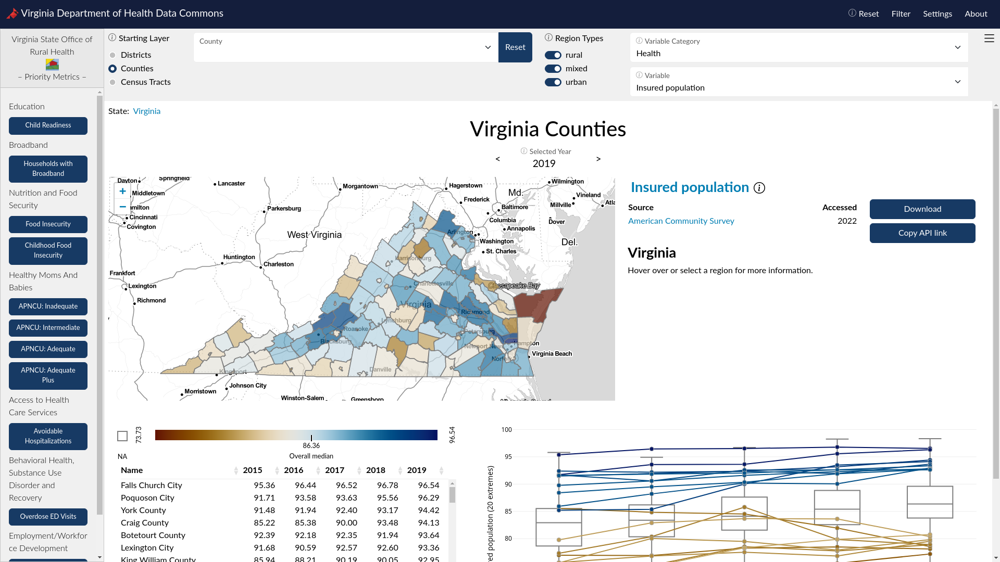

## Stakeholder(s)
- MasterCard Center for Inclusive Growth ([MasterCard Center](https://www.mastercardcenter.org/))
- Virginia Department of Health ([VDH](https://www.vdh.virginia.gov/))
- Fairfax County Countywide Data Analytics Unit ([CDA](https://www.fairfaxcounty.gov/data/))

## What is a Data Commons?
Data commons is an open knowledge repository that co-locates data from a variety of sources, builds and curates data insights, and provides tools designed to track issues over time and geography allowing governments and community stakeholders to learn continuously from their own data.

The Social and Decision Analytics Division has already deployed several data commons to empower policymakers with easy access to data analysis and visualizations. One example is the [Virginia Department of Health Data Commons](https://uva-bi-sdad.github.io/vdh_rural_health_site/).

Local communities have data on policies, strategies, events, and social behaviors but often lack the analytical tools to use their valuable data. Partnering with the **Mastercard Center for Inclusive Growth**, we hope to equip local communities in the National Capital Region with easy access to analytical tools like this to drive policy and strategy development.

## Cost of Living Calculator

One important section of our data commons is the proportion of households at risk of food insecurity in each region. To make a reliable estimation of households at risk, we need a trustworthy calculator for the cost of living in each corresponding region. To account for sub-county level variations in cost of living, the geographic resolution we target is at census-tract level. According to the [U.S. Census Bureau](https://www.census.gov/programs-surveys/geography/about/glossary.html#par_textimage_13), a census tract is 

### Comparisons of Existing Calculators
We started our process by comparing three cost of living calculators.

They are
- Economic Policy institute(EPI)
- MIT living Wage Calculator
_ Washing Self Sufficiency (CFWW)

### Our Sources

Something here

### Examples from Fairfax County, VA

Something here

## Application with Food Insecurity

something here

### Iterative Proportional Fitting (IPF)

something here

### Examples from Fairfax County, VA

3 census tracts from last week

## Evaluation of results

Caveats, implications, etc.

## Team

Some pictures here
