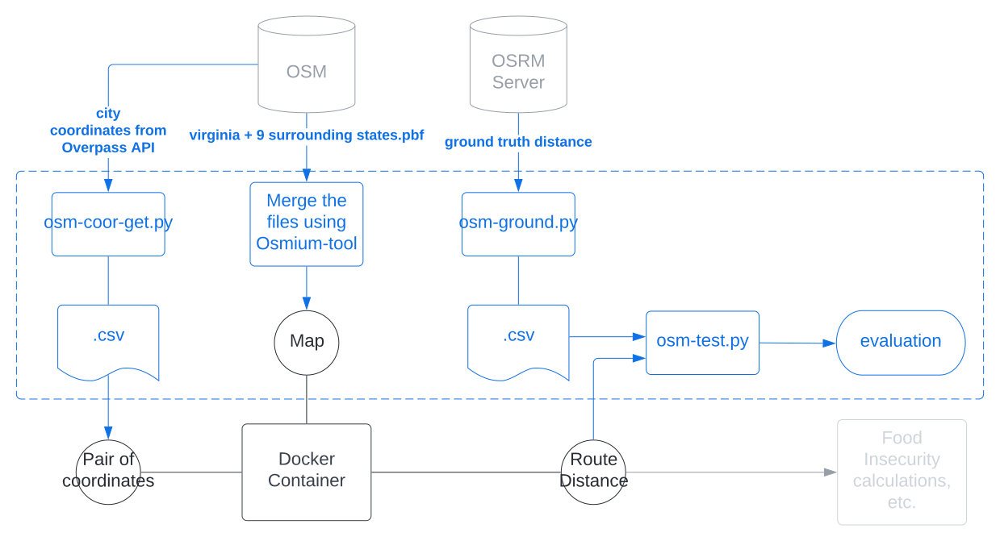

Find a way to get the Open Source Routing Machine (OSRM) to return the correct routing for destinations outside of Virginia. Correspondingly, create a standardized operating procedure for merging and testing OSM files.

## Introduction

In order to make accessibility calculations such as the two-step floating catchment areas  ([2SFCA](https://en.wikipedia.org/wiki/Two-step_floating_catchment_area_method)), it is necessary to have correct distances. While we are only looking inside Virginia now, what about people who travel outside Virginia to accomplish day-to-day tasks? Moreover, what if we want to make a more extensive map incorporating other states in the future? In order to do so, we must develop a procedure to merge and test Open Street Map (OSM) data.

## Methods

**We automated a route distance validation process (marked in blue) and incorporated it into the existing infrastructure.**

Building off our existing infrastructure, we elect to create our own Docker instance to honor the OSRM [usage policy](https://github.com/Project-OSRM/osrm-backend/wiki/Api-usage-policy). To merge OSM Protocolbuffer Binary Format (PBF) files for our own Docker instance, then, we utilize the open-source tool [Osmium](https://osmcode.org/osmium-tool/). Using Python, we then extract valid routing locations using the Overpass API and ground truth distances from the OSRM server. Finally, we compare the results between our server with the OSRM server to evaluate the quality of the merge.

## Results
We test our merged files with 1000 random city pairs from the following states "DC", "DE", "KY", "MD", "NC", "NJ", "PA", "TN", "VA", "WV". We achieved an overall match of 819/1000 (82\%) with a mean absolute difference of 1284.87 meters.

## Discussions
A couple of tricky things people might encounter in the process:
  - The overpass returns the locations in (latitude, longitude), but the OSRM takes query in (longitude, latitude).
  - The researcher will need sufficient computing power when extracting the merged file for the docker instance, especially for larger files. Otherwise, the extraction will fail silently—the successful extract last messages are recorded [here](https://gist.github.com/yaoeh/859cefaea7b61046d084ead1b3d104a1).
  - The queries do not always return ``Invalid route", even for two coordinates that do not make sense (i.e., New York to China). So, checking for zero distances is another sanity check to see if queries make sense.

## Conclusion
We created a standard operating procedure to merge and test OSM files for OSRM queries. Additionally, we documented the process and open-sourced our code.

## Online resources
We share the following resources to aid future researchers in the same endeavor:
    - [GitHub gist merging OSM files](https://gist.github.com/yaoeh/859cefaea7b61046d084ead1b3d104a1)
    - [GitHub repository for automated OSRM testing](https://github.com/yaoeh/dspg22_osm-tester)
