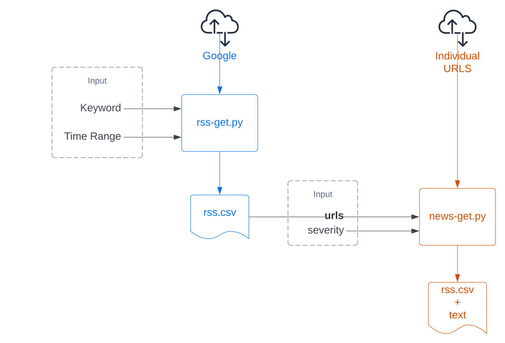

## Stakeholder(s)
Gary Andersen, National Center for Science and Engineering Statistics ([NCSES](https://ncses.nsf.gov/))

## Abstract
The Product Innovation project is a proof-of-concept toolkit that aims to track innovation activities sustainably using
[opportunity data](https://hdsr.mitpress.mit.edu/pub/hnptx6lq/release/10). The toolkit accelerates [Really Simple Syndication (RSS)](https://en.wikipedia.org/wiki/RSS) queries and news source text extraction using open-source modules and browser automation. The collected texts are then piped to natural language processing (NLP) modules that detect business, product, and innovation status.

## Introduction
The goal of our project was to explore the feasibility of complimenting the NCSES [Business Research and Discovery Innovation Survey (BRDIS) Survey](https://www.nsf.gov/statistics/srvyindustry/about/brdis/interpret.cfm) with alternative data sources. Since traditional innovation indicators such a patents and questionnaire-based surveys can suffer from a lack of timeliness, granularity, and coverage [^1], we looked towards complementing the survey findings with information from opportunity data on the web. During our search, however, we realized that it was not trivial to obtain this text data in a free and open-source way. We contribute this summer by creating an example framework for researchers to extract news text.

## Background
Several prior works have utilized website text as a means to track innovation. For example, Axenbeck and Breihaupt found that text features on websites make the biggest contribution to their innovation prediction performance for their sample of over 4,000 German firms [^2]. Similarly,... 

[^1]: Kinne, Jan, and Janna Axenbeck. "Web mining for innovation ecosystem mapping: a framework and a large-scale pilot study." Scientometrics 125, no. 3 (2020): 2011-2041.
[^2]: Axenbeck, Janna, and Patrick Breithaupt. "Innovation indicators based on firm websites—Which website characteristics predict firm-level innovation activity?." PloS one 16, no. 4 (2021): e0249583.

## Method

We created two modules, the **rss-get** module, and the **news-get** module. We separate these because extracting information from news sites take a varying amount of time.

### Search Engine Comparison
To find rss feeds, we looked towards some of the most popular search engines with the following three criteria: 1) the search engine should have keyword search capabilities, 2) the rss should return a sentence snippet, and 3) the engine should allow search by time range. We compiled the results of our search in following table:

|**Source**|**Type**|**Keyword**|**Snippet**|**Time Range**|**Notes**|
|--|--|--|--|--|--|
|[Google](https://news.google.com/rss/search?q={0})|Search Engine|<span style="color:green">Found</span>|<span style="color:green">Found</span>|<span style="color:green">Found</span>|<ul><li>Successful RSS keyword extraction using: https://news.google.com/rss/search?q={0}</li><li>Column _summary_detail.value_ might contain one sentence description of the news</li></ul>|
|[Bing](https://www.bing.com/news/search?q={0}&format=rss)|Search Engine|<span style="color:green">Found</span>|<span style="color:green">Found</span>|<span style="color:red">Not found</span>|<ul><li>Successful RSS keyword extraction using: https://www.bing.com/news/search?q={0}&format=rss</li><li>Column _summary_detail.value_ might contain 2-3 sentences of the news </li></ul>|
|[Baidu](?)|Search Engine|<span style="color:red">Not found</span>|<span style="color:red">Not found</span>|<span style="color:red">Not found</span>|<ul><li>We found a website https://www.baidu.com/search/rss.html that seems to describe the existance of rss functioning. However, upon clicking into the keyword search field, I kept being returned the same news in non-RSS format</li></ul>|
|[Yahoo News](https://news.yahoo.com/rss)|News Channel|<span style="color:red">Not found</span>|<span style="color:red">Not found</span>|<span style="color:red">Not found</span>|<ul><li>Does not seem to allow keyword searches. If you do a yahoo search with news it automatically returns search.yahoo.com.</li><li>You can manipulate the [URL](https://news.search.yahoo.com/search;_ylt=A2KIbMuIVJpipzUAhiNXNyoA;_ylu=Y29sbwNiZjEEcG9zAzEEdnRpZAMEc2VjA3Nj?p={KEYWORD}&fr=news) to do news page sources, but it does not seem like they will convert it into an RSS format for us </li></ul>
|[Yandex](https://yandex.com/)|Search Engine|<span style="color:red">Not found</span>|<span style="color:red">Not found</span>|<span style="color:red">Not found</span>|<ul><li>robots.txt disallows /company/*.rss, /company/search. Returns results in Russian?</li><li>Upon searching [sitemaps](https://yandex.com/support/sitemap.xml), found an rss source at [https://zen.yandex.ru/](https://zen.yandex.ru/search?query={0}). However, to subscribe to any of the feeds require signing in</li></ul>|
|[Ask](https://www.ask.com/rss)|Search Engine|<span style="color:red">Not found</span>|<span style="color:green">Found</span>|<span style="color:red">Not found</span>|<ul><li> Found https://www.ask.com/rss, but so far haven't found a way to add a keyword. </li> <li> Looked through: https://www.ask.com/sitemap_index.xml and https://www.ask.com/robots.txt but did not find anything rss-related</li><li>Column _metadescription_ contains 2 sentences </ul>|
|[ABC News](https://abcnews.go.com)|General Media|<span style="color:green">Found</span>|<span style="color:red">Not found</span>|<span style="color:red">Not found</span>|<ul><li>Does not have usable rss feed. Web scraping with keyword search is possible, but most of the content seems to be videos without transcript.</li></ul>
---

### Source Text Extraction
Once we found a rss-feed search the avails us keywords and snippets, we realized that the snippets we find are mostly 1-2 sentences, which is less than the 3 we hoped that would allow us to run the Natural Language Processing (NLP) more effectively. As a result, we started to investigate the retrieval of source text directly.

#### Severity Levels
As we collected source text, we realized that news sources have a varying degree of "friendliness" to being scraped. In other words, some websites intentionally resist source text from being extracted. We introduced the concept of _severity_ to our system so that we can navigate spending more computational power in order to access these more difficult websites. 

|**Severity**|**Definition**|
|--|--|
|0| The website source text can be extracted using just http-get |
|1| The website source text can be extracted using an automated without additional add-ons |
|2| The website source text cannot be extracted using severity 0 or 1 (i.e., additional work is needed to gain access to the information)|

During our search, however, we found that more than 80% of the websites are retrievable using severity 0. To not cause undue burden to the content hosts, we did our evaluation of the system using only severity 0 source text. 

#### News Article Parser Comparison
Using Python, we searched for open source article parsers ([Newspaper3k](https://github.com/codelucas/newspaper), [Article Parser](https://github.com/myifeng/article-parser), [Sumy](https://github.com/miso-belica/sumy)) and we manually checked a sample of the news articles to elucidate common ways an extraction might fail. We used the following articles: [bloomberg](https://www.bloomberg.com/news/newsletters/2022-06-07/apple-s-troubles-in-china-aren-t-going-away-quickly), [usatoday](https://www.usatoday.com/story/tech/2022/06/06/wwdc-22-apple-pay-buy-now-pay-later/7534225001/), [reuters](https://www.reuters.com/markets/stocks/australias-bnpl-stocks-wilt-after-apple-announces-entry-2022-06-07/), [forbes](https://www.forbes.com/sites/davidphelan/2022/05/13/apple-iphone-15-insider-leaks-astonishing-design-change/), [appleinsider](https://appleinsider.com/articles/22/05/15/ios-16-will-have-refreshed-apple-apps-but-look-the-same).

The goal of the comparison is to elucidate common ways an extraction might fail. We summarize our lessons below:

|**Package**|**Article**|**Status**|**Notes**|
|--|--|--|--|
|Newspaper3k| bloomberg |<span style="color:red">Failed </span>|Returns a response: "Why did this happen? Please make sure your browser supports JavaScript and cookies and that you are not blocking them from loading. For more information you can review our Terms of Service and Cookie Policy." Likely additional work needs to be done in order to extract this data |
||usatoday|<span style="color:green">Passed</span>|While the extraction has worked successfully, the parser cannot easily discern between the genuine article or the ads for different articles embedded|
||reuters|<span style="color:green">Passed</span>|Issue is the same as above; some ad text are still embedded, but the overall parser works relatively well|
||forbes|<span style="color:red">Failed</span>|Program quits with error: "failed with 403 Client Error: Max restarts limit reached for url"|
||appleinsider|<span style="color:green">Passed</span>|Works as expected.|
|Article Parser|bloomberg|<span style="color:red">Failed</span>|JavaScript we required. Selenium is needed to scrap bloomberg|
||usatoday|<span style="color:green">Passed</span>|Between-paragraph links are included|
||reuters|<span style="color:green">Passed</span>|Side-bar and between-paragraph ads are included|
||forbes|<span style="color:green">Passed</span>|Between-paragraph links are included|
||appleinsider|<span style="color:red">Failed</span>|Failed to identify the main article. Parsed a side-bar link instead|
|Sumy|bloomberg|<span style="color:red">Failed</span>|Blocked by not-a-robot test|
||usatoday|<span style="color:green">Passed</span>|Kept only a fresh text, no links or ad prompts. BUT, any sentence containing a link is removed|
||reuters|<span style="color:green">Passed</span>|All texts are preserved, and no links mixed in the text. Between-paragraph ads are however also kept|
||forbes|<span style="color:green">Passed</span>|All text are preserved with url content removed. Ads are partially removed but still mixed within|
||appleinsider|<span style="color:red">Failed</span>|No text retrieved. Possibly identified the wrong element so no effective sentence found within|
---

## Results

### Source Text Extraction
Using keywords on pharmaceuticals extracted from the NACIS, we used ```rss-get``` to retrieve aset of keywords and we extracted 6386 articles for 2017 phrama-related articles.


<iframe href="../assets/fig/product-innovation_extracted-text.html"</iframe>


### NLP
Based on prior work from Neil, we did some things...

### Multi-threading and speed-ups
We implemented an example multi-threaded pipeline to extract data from each website without making too many queries to a website as once. (Insert Steve Figure here)

## Discussions
- News articles are rich sources of data that with the rise of natural language models, can be used to benefit government organizations?
- Allow for opportunity data in the form of news to be accessible to researchers
- Encourages research reproducibility

## Limitations and Future Works
- Write about how severity is difficult
- Write about sometimes needing to use VPN to not get black-listed by websites
- Searching for a way to compare with a ground-truth metric
- ,etc.

## Contact
- Alan Wang (ahw9f@virginia.edu)
- Steve Zhou (wz8ry@virginia.edu)
- Neil Kattampallil (nak3t@virginia.edu)

---
