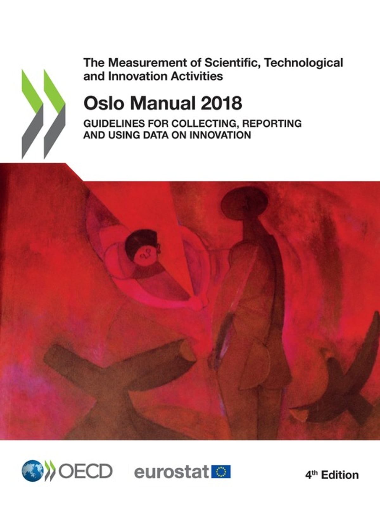

## Stakeholder(s)
Gary Anderson, National Center for Science and Engineering Statistics ([NCSES](https://ncses.nsf.gov/))

## Abstract
The Product Innovation project is a proof-of-concept toolkit that aims to track innovation activities sustainably using
[opportunity data](https://hdsr.mitpress.mit.edu/pub/hnptx6lq/release/10). The toolkit accelerates [Really Simple Syndication (RSS)](https://en.wikipedia.org/wiki/RSS) queries and news source text extraction using open-source modules and browser automation. We then applied natural language processing (NLP) to analyze the collected texts to detect business, product, and innovation status.

## Introduction
The goal of our project was to explore the feasibility of complementing the [Annual Business Survey (ABS)](https://www.census.gov/programs-surveys/abs.html)  with alternative data sources.

The National Center for Science and Engineering Statistics (NCSES), part of the National Science Foundation (NSF) conducts the Annual Business Survey to collect data on R&D, innovation, technology, intellectual property, and business owner characteristics. This information was previously collected through the Business R&D Innovation Survey (BRDIS)

While ABS measures innovation incidence, i.e., the number of innovating firms, our aim is to test the feasibility of developing methods using non-traditional data to obtain richer and complementary innovation measures [^1], and as part of this, we investigated the use of opportunity data on the web. While accessing websites individually as humans is easy, we found it non-trivial to automate news-text extraction in a free and open-source way. Consequently, we contribute this summer by creating an example framework for researchers to extract news text.

## Product Innovation : Defined
In order to decide whether a news article is actually innovation related or not, we must first define what we mean by product innovation.
For this, we use the definition contained within the Oslo Manual
First published in 1992, the [Oslo Manual](https://www.oecd.org/science/oslo-manual-2018-9789264304604-en.htm) is the international reference guide for collecting and using data on innovation, published by the [Organization for Economic Cooperation and Development (OECD)](https://www.oecd.org/)



>Product Innovation Definition - As per the Oslo Manual 2018
Guidelines for Collecting, Reporting and Using Data on Innovation, 4th Edition
>>“ A product innovation is a new or improved good or service that differs significantly from the firm’s previous goods or services and that has been made available to potential users. “

## Related Works
We found several prior works that utilized web information to track innovation activities. For example, in 2013, Arora et al. used web-scraping techniques to track the innovation activity of smaller firms whose limited resources do not readily permit activities such as publishing and patenting [^2]. Gök et al. also investigated website data for effectiveness as a research method for innovation studies [^3]. They observe that far more companies report undertaking R&D activities on their websites than would be suggested by looking only at conventional data sources. Gök et al. additionally found that web mining offers insights that are more downstream in the innovation process. More recently, Axenbeck and Breihaupt found that website text features significantly contribute to their innovation prediction performance for over 4,000 German firms [^4]. While many papers found the web helpful in tracking innovation activity, we did not find a study that evaluated the feasibility of news article source text on the web to track innovation activity.

[^1]: Kinne, Jan, and Janna Axenbeck. "Web mining for innovation ecosystem mapping: a framework and a large-scale pilot study." Scientometrics 125, no. 3 (2020): 2011-2041.
[^2]: Arora, Sanjay K., Jan Youtie, Philip Shapira, Lidan Gao, and TingTing Ma. "Entry strategies in an emerging technology: a pilot web-based study of graphene firms." Scientometrics 95, no. 3 (2013): 1189-1207.
[^3]: Gök, Abdullah, Alec Waterworth, and Philip Shapira. "Use of web mining in studying innovation." Scientometrics 102, no. 1 (2015): 653-671.
[^4]: Axenbeck, Janna, and Patrick Breithaupt. "Innovation indicators based on firm websites—Which website characteristics predict firm-level innovation activity?." PloS one 16, no. 4 (2021): e0249583.

## Method
We created two modules, the **rss-get** module, and the **news-get** module. The **rss-get** takes in keywords and returns urls, and the **news-get** takes in urls and returns source text. Below, we document how we arrived at our comparison of search engines, our comparison of source text extractors, and the concept of _severity_ with which we use to classify the difficulty of websites from being scraped. 

### Search Engine Comparison
To find rss feeds, we looked towards some of the most popular search engines with the following three criteria: 1) the search engine should have keyword search capabilities, 2) the rss should return a sentence snippet, and 3) the engine should allow search by time range. We compiled the results of our search in following table:

|**Source**|**Type**|**Keyword**|**Snippet**|**Time Range**|**Notes**|
|--|--|--|--|--|--|
|[Google](https://news.google.com/rss/search?q={0})|Search Engine|<span style="color:green">Found</span>|<span style="color:green">Found</span>|<span style="color:green">Found</span>|<ul><li>Successful RSS keyword extraction using: https://news.google.com/rss/search?q={0}</li><li>Column _summary_detail.value_ might contain one sentence description of the news</li></ul>|
|[Bing](https://www.bing.com/news/search?q={0}&format=rss)|Search Engine|<span style="color:green">Found</span>|<span style="color:green">Found</span>|<span style="color:red">Not found</span>|<ul><li>Successful RSS keyword extraction using: https://www.bing.com/news/search?q={0}&format=rss</li><li>Column _summary_detail.value_ might contain 2-3 sentences of the news </li></ul>|
|[Baidu](?)|Search Engine|<span style="color:red">Not found</span>|<span style="color:red">Not found</span>|<span style="color:red">Not found</span>|<ul><li>We found a website https://www.baidu.com/search/rss.html that seems to describe the existance of rss functioning. However, upon clicking into the keyword search field, I kept being returned the same news in non-RSS format</li></ul>|
|[Yahoo News](https://news.yahoo.com/rss)|News Channel|<span style="color:red">Not found</span>|<span style="color:red">Not found</span>|<span style="color:red">Not found</span>|<ul><li>Does not seem to allow keyword searches. If you do a yahoo search with news it automatically returns search.yahoo.com.</li><li>You can manipulate the [URL](https://news.search.yahoo.com/search;_ylt=A2KIbMuIVJpipzUAhiNXNyoA;_ylu=Y29sbwNiZjEEcG9zAzEEdnRpZAMEc2VjA3Nj?p={KEYWORD}&fr=news) to do news page sources, but it does not seem like they will convert it into an RSS format for us </li></ul>
|[Yandex](https://yandex.com/)|Search Engine|<span style="color:red">Not found</span>|<span style="color:red">Not found</span>|<span style="color:red">Not found</span>|<ul><li>robots.txt disallows /company/*.rss, /company/search. Returns results in Russian?</li><li>Upon searching [sitemaps](https://yandex.com/support/sitemap.xml), found an rss source at [https://zen.yandex.ru/](https://zen.yandex.ru/search?query={0}). However, to subscribe to any of the feeds require signing in</li></ul>|
|[Ask](https://www.ask.com/rss)|Search Engine|<span style="color:red">Not found</span>|<span style="color:green">Found</span>|<span style="color:red">Not found</span>|<ul><li> Found https://www.ask.com/rss, but so far haven't found a way to add a keyword. </li> <li> Looked through: https://www.ask.com/sitemap_index.xml and https://www.ask.com/robots.txt but did not find anything rss-related</li><li>Column _metadescription_ contains 2 sentences </ul>|
|[ABC News](https://abcnews.go.com)|General Media|<span style="color:green">Found</span>|<span style="color:red">Not found</span>|<span style="color:red">Not found</span>|<ul><li>Does not have usable rss feed. Web scraping with keyword search is possible, but most of the content seems to be videos without transcript.</li></ul>
---

#### Example RSS Query
Finding the Google offers the most comprehensive rss news query, we proceded with Google. Below, we include an example rss query to google:
```python
https://news.google.com/rss/search?q={0}+after:{1}+before:{2}
```
Where {0} is filled with the keyword, {1} is filled with end time, and {2} is filled with the start time. An example query would then look like this:

[https://news.google.com/rss/search?q=Birth%20control%20pills%20+after:2017-01-01+before:2017-12-31](https://news.google.com/rss/search?q=Birth%20control%20pills%20+after:2017-01-01+before:2017-12-31)

### Source Text Extraction
Once we found a rss-feed search the avails us keywords and snippets, we realized that the snippets we find are mostly 1-2 sentences, which is not sufficient to  allow us to run the Natural Language Processing (NLP) effectively. As a result, we started to investigate the retrieval of source text directly.

#### Severity Levels
As we collected source text, we realized that news sources have a varying degree of "friendliness" to being scraped. In other words, some websites intentionally resist source text from being extracted. We introduced the concept of _severity_ to our system so that we can navigate spending more computational power in order to access these more difficult websites. 


*An example news article that embeds advertisement text directly with the source text. Different websites can use schemes that intentionally or unintentionally hinder automated text extractions.*

|**Severity**|**Definition**|
|--|--|
|0| The website source text can be extracted using just http-get |
|1| The website source text can be extracted using an automated browser without additional add-ons |
|2| The website source text cannot be extracted using severity 0 or 1 (i.e., additional work is needed to gain access to the information)|

During our search, however, we found that more than 80% of the websites are retrievable using severity 0. To not cause undue burden to the content hosts, we did our evaluation of the system using only severity 0 source text. 

#### News Article Parser Comparison
Using Python, we searched for open source article parsers ([Newspaper3k](https://github.com/codelucas/newspaper), [Article Parser](https://github.com/myifeng/article-parser), [Sumy](https://github.com/miso-belica/sumy)) and we manually checked a sample of the news articles to elucidate common ways an extraction might fail. We used the following articles: [bloomberg](https://www.bloomberg.com/news/newsletters/2022-06-07/apple-s-troubles-in-china-aren-t-going-away-quickly), [usatoday](https://www.usatoday.com/story/tech/2022/06/06/wwdc-22-apple-pay-buy-now-pay-later/7534225001/), [reuters](https://www.reuters.com/markets/stocks/australias-bnpl-stocks-wilt-after-apple-announces-entry-2022-06-07/), [forbes](https://www.forbes.com/sites/davidphelan/2022/05/13/apple-iphone-15-insider-leaks-astonishing-design-change/), [appleinsider](https://appleinsider.com/articles/22/05/15/ios-16-will-have-refreshed-apple-apps-but-look-the-same).

The goal of the comparison is to elucidate common ways an extraction might fail. We summarize our lessons below:

|**Package**|**Article**|**Status**|**Notes**|
|--|--|--|--|
|Newspaper3k| bloomberg |<span style="color:red">Failed </span>|Returns a response: "Why did this happen? Please make sure your browser supports JavaScript and cookies and that you are not blocking them from loading. For more information you can review our Terms of Service and Cookie Policy." Likely additional work needs to be done in order to extract this data |
||usatoday|<span style="color:green">Passed</span>|While the extraction has worked successfully, the parser cannot easily discern between the genuine article or the ads for different articles embedded|
||reuters|<span style="color:green">Passed</span>|Issue is the same as above; some ad text are still embedded, but the overall parser works relatively well|
||forbes|<span style="color:red">Failed</span>|Program quits with error: "failed with 403 Client Error: Max restarts limit reached for url"|
||appleinsider|<span style="color:green">Passed</span>|Works as expected.|
|Article Parser|bloomberg|<span style="color:red">Failed</span>|JavaScript we required. Selenium is needed to scrap bloomberg|
||usatoday|<span style="color:green">Passed</span>|Between-paragraph links are included|
||reuters|<span style="color:green">Passed</span>|Side-bar and between-paragraph ads are included|
||forbes|<span style="color:green">Passed</span>|Between-paragraph links are included|
||appleinsider|<span style="color:red">Failed</span>|Failed to identify the main article. Parsed a side-bar link instead|
|Sumy|bloomberg|<span style="color:red">Failed</span>|Blocked by not-a-robot test|
||usatoday|<span style="color:green">Passed</span>|Kept only a fresh text, no links or ad prompts. BUT, any sentence containing a link is removed|
||reuters|<span style="color:green">Passed</span>|All texts are preserved, and no links mixed in the text. Between-paragraph ads are however also kept|
||forbes|<span style="color:green">Passed</span>|All text are preserved with url content removed. Ads are partially removed but still mixed within|
||appleinsider|<span style="color:red">Failed</span>|No text retrieved. Possibly identified the wrong element so no effective sentence found within|
---

## Results

### Source Text Extraction
Using [keywords on pharmaceuticals extracted from the NACIS](https://www.naics.com/naics-code-description/?code=325411), we used ```rss-get``` to retrieve a set of keywords and we extracted 6386 articles for 2017 phrama-related articles.

[](../assets/fig/product-innovation_extracted-text.html)

Note the 100 article max that is associated with each keyword. To learn more about the particulars of the google rss search queries, we recommend this article [^5].

[^5]: https://newscatcherapi.com/blog/google-news-rss-search-parameters-the-missing-documentaiton

### Comparison of severity
We used a random sample of 500 URLs from the 9000 URLs we pulled from the most **rss-get** of the same afroementioned keywords list, and compared severity zero and severity one results.

|**Severity Level**|**Running Time**|**Articles/Second**|**Success Rate**|
|--|--|--|--|
0 | 03:02 |1.13| 88.2% |
1 | 07:22 |2.47| 92.4% |
---
We did not attempt to do any severity 2 activities to bypass the security put up by the found websites.
[You can view a sample of articles we have been able to extract here](https://thomasneil.github.io/random-graph-generator/test)
## Discussions
The main challenge we see with news source text extraction is how websites update their source code rapidly. As new vulnerability arises on the web, so do the defense measures taken to limit the survey of websites from robots. We identify the following key areas as the upsides of complementing survey data with news data.

### A low severity level is often sufficient
Based on our sample, we argue that the 4.2% success rate increase is not worth the penalty incurred on the running time. Furthermore, the move towards severity two source text extractions is hardly sustainable since news websites routinely update their source code which breaks site-specific modifications required to retrieve the information.

### The source data is timely and reproducible
Text artifacts are rich data sources that effectively indicate innovation activity. With the rise of natural language models, the efficacy of news articles is only expected to grow. Creating an open-source toolkit can allow future government organizations and researchers to leverage previously unstructured data more efficiently without causing too much traffic to the main content hosting sites.

### Going to Severity 2
A higher severity level will give us more information, but also requires an increased amount of computing resources. Moreover, the universality of Severity 2 program makes another challenge. When facing additional protections, although we can optimize our code to target a few particular sites with a randomized header or a JavaScript tag, it is very difficult to construct an omnipotent program to handle all sites. Going forward, we might implement source-specific measures to retrieve articles from sites that are of particularly high value for the industry searched, but we will not be able to guarantee a 100% success rate for all sites.

## Limitations and Future Works
We identify future directions for technological upgrades but also updates in principle. The main step for the future is to identify if the collected dataset is a representative sample of the innovation activity happening in the US. Towards this end, identifying the right keywords to search and comparing with other brokered data sources would allow us to see if the links we found are comparable or complementary. For the technical sides, we list the following challenges:

### Advertisement cleaning
Advertisements can be misleading for our NLP classifiers, as its text can be proximate to a new product. Although the parser we have implemented can remove some ads by their HTML tags, the way certain news source embed ads still poses future challenges. For example, this [Bloomberg article](https://www.bloomberg.com/news/newsletters/2022-06-07/apple-s-troubles-in-china-aren-t-going-away-quickly) contains a "Today's must-read" section that embeds links to other Bloomberg webpages, and this type of ads is hard for the parser to identify. One possible solution, as used by the SUMY package, is to remove all text with URLs embedded, i.e. ignore texts in HTML's \<a\> tag. But we may lose important information in scenarios when, for example, the news report attached a link to the manufacturer's page of the new product.

### Black-listed by the website
Most websites have traffic-monitoring measures to protect their host server, and we will not repeatedly send requests to the same host without a few seconds' wait. Nevertheless, some websites, such as [Fierce Pharma](https://www.fiercepharma.com/), have particularly conservative protective measures that seem to be also tracking the amount of traffic through our IP, and would block our requests for several hours. If we want to secure a reliable retrieval of information from these websites in the future, we might need a distributed web of servers and IP ports, which poses higher need for computing power and higher risk of offending the content host.

### NLP
Based on prior work done by the lab, including our process of [building supervised classification models](https://www.methodspace.com/blog/novelty-in-the-news-detecting-innovation-with-machine-learning)  through [BERT based Language models](https://ieeexplore.ieee.org/document/9483744) using human-labeled training sets, we have an existing model that can be used to predict whether or not a news article is about a new, innovative product.
Once we extract the innovation-related articles from the dataset, we can apply the techniques of [Named Entity Recognition](https://en.wikipedia.org/wiki/Named-entity_recognition) and [Question Answering](https://en.wikipedia.org/wiki/Question_answering) to extract specific pieces of information from the article text. Our objective in building this news extraction tool is to create a free and open source way to obtain article data for the analysis of specific industries, in a way that can neatly integrate with our existing NLP pipeline.

A Sample of our Initial results is presented here:

| Article title                                                                                                                                                                                                          | NER extracted Organizations ner\_org                                                                                                                                                                                                                                              | QA Extracted companies qa\_company\_1                                                 | QA extracted Products qa\_product\_1                                                        |
| -------------------------------------------------------------------------------------------------------------------------------------------------------------------------------------------------------------- | ----------------------------------------------------------------------------------------------------------------------------------------------------------------------------------------------------------------------------------------------------- | -------------------------------------------------------------- | --------------------------------------------------------------------- |
| FDA's Approval of Generic Version of Jazz Pharma's Sleep Disorder Drug Raises Questions - Regulatory Focus                                                                                                     | \['Jazz Pharmaceuticals', 'FDA', 'US Food and Drug Administration', 'Jazz Pharma', 'Jazz', 'X', 'Berstein', 'Citizen'\]                                                                                                                               | Jazz                                                           | Xyrem                                                                 |
| The Bitter Pill: Harvard and the Dark History of Birth Control  Magazine - Harvard Crimson                                                                                                                     | \['Harvard', 'Gregory', 'SC', 'MA'\]                                                                                                                                                                                                                  | Rock and Pincus                                                | birth control pill                                                    |
| Fostering Global Regulatory Collaboration In The Marketing Of Combination Products - Contract Pharma                                                                                                           | \['Center for Drug Evaluation and Research', 'FDA', 'United States Center for Devices and Radiological Health', 'Center for Biologics Evaluation and Research', 'EU', 'CDRH', 'CDER', 'CBER', 'European Union', 'CBE'\]                               | The most important therapeutic action                          | a higher-quality combination product                                  |
| 13 things you need to know about HIV self-testing - SowetanLIVE                                                                                                                                                | \['WHO', 'TimesLIVE', 'Pick n Pay', 'Dischem', '##SU'\]                                                                                                                                                                                               | BioSURE                                                        | self-test kits                                                        |
| Sang Jo Kim, MD - Anesthesiology - Hospital for Special Surgery                                                                                                                                                | \['Cambridge University Press', 'Regional An', '& Pain Medicine', 'Ana'\]                                                                                                                                                                             | Belmont                                                        | Liver Transplant Anesthesia Fellowship                                |
| Riverchase Dermatology and Cosmetic Surgery Acquires Bowes Dermatology - PR Newswire                                                                                                                           | \['Bowes Dermatology', 'Riverchase', 'PA', '##con', 'Riverchase Dermatology and Cosmetic Surgery', 'ARNP', 'Riverchase Dermatology', 'C', 'FAAD', 'D', 'Mercy', 'Le', 'Bow', 'River', 'E', 'Surgery', '##AD', '##uzel', 'CO', 'Co', 'MD'\]            | Riverchase Dermatology and Cosmetic Surgery                    | Bowes Dermatology                                                     |
| Endometriosis and the Birth Control Pill: What You Need to Know - Endometriosis News Today                                                                                                                     | None                                                                                                                                                                                                                                                  | endometriosis.org.<br>                                         | combined oral contraceptive pill                                      |
| New autoimmune endocrine disease triggered by thymomas - EurekAlert                                                                                                                                            | \['Scientific', 'Kobe University Graduate'\]                                                                                                                                                                                                          | BANDO                                                          | hypopituitarism                                                       |
| To medicate my anxious child or not. It's an emotive question - Special Needs Jungle                                                                                                                           | \[\]                                                                                                                                                                                                                                                  | fearful                                                        | Sertraline                                                            |
| Current Concepts in 68Ga-DOTATATE Imaging of Neuroendocrine Neoplasms: Interpretation, Biodistribution, Dosimetry, and Molecular Strategies - Journal of Nuclear Medicine                                      | \['AAA Pharmaceutical', 'Ipsen', '##n', 'Biosciences', 'I', '##um'\]                                                                                                                                                                                  | Sofie Biosciences                                              | PET/CT                                                                |
| Preventing Substance Abuse in ADHD Takes Early Treatment, Harvard Expert Says - AJMC.com Managed Markets Network                                                                                               | \['Division of Child and Adolescent Psychiatry', 'Center for Addiction Medicine', '30th US Psychiatric and Mental Health Congress', 'Harvard Medical School', 'Harvard'\]                                                                             | extended release formulations                                  | Stimulant ADHD medication                                             |
| What's next for pharma innovation in China - McKinsey                                                                                                                                                          | \['Lilly Asia Ventures', 'China Food and Drug Administration', 'CStone Pharmaceuticals', 'CFDA', 'McKinsey', 'Novartis', 'WuXi AppTec', 'Hua Medicine', 'Roche R & D Center', 'R & D', '##iopha', '##K', 'B', '&'\]                                   | WuXi AppTec                                                    | First, more innovative medicines are poised to reach Chinese patients |
| Why high-dose vitamin C kills cancer cells: Low levels of catalase enzyme make cancer cells vulnerable to high-dose vitamin C - Science Daily                                                                  | \['University of Iowa', 'Redox Biology', 'U', 'UI', 'Iowa', 'University'\]                                                                                                                                                                            | less efficient in removing hydrogen peroxide than normal cells | high-dose vitamin C                                                   |
| Inspirion Delivery Sciences Receives FDA Approval for RoxyBondâ„¢ (oxycodone hydrochloride) tablets CII, the First and Only Immediate Release Opioid Analgesic with Abuse-Deterrent Label Claims - PR Newswire | \['United States Food and Drug Administration', 'FDA', 'Inspirion Delivery Sciences, LLC', 'RoxyBond', 'BA', 'Inspirion', 'MD', '##K', 'Roxy', 'Lynn'\]                                                                                               | Inspirion Delivery Sciences, LLC                               | RoxyBondâ„¢                                                           |
| Diabetes: New insulin sensitizers discovered: Potential drug lowered blood sugar without triggering fat storage in mice - Science Daily                                                                        | \['Columbia University Diabetes Research Center', 'CUMC', 'Columbia University', '##rrie'\]                                                                                                                                                           | AstraZeneca                                                    | insulin sensitizers                                                   |
| FDA approval brings first gene therapy to the United States  FDA - FDA.gov                                                                                                                                     | \['FDA', 'National', 'U. S. Food and Drug Administration', 'Institute', 'U', '##ria', 'K'\]                                                                                                                                                           | Novartis Pharmaceuticals Corp                                  | Kymriah                                                               |
| Emergent Biosolutions modifies contract with BARDA for supplying botulism antitoxin to national stockpile - Homeland Preparedness News                                                                         | \['B', '##iomedical Advanced Research and Development Authority', 'Centers for Disease Control and Prevention', 'Emergent Biosolutions', 'BARDA', 'Emergent', 'U', 'Strategic National Stockpile', 'U. S. Food and Drug Administration', 'S'\]        | Emergent Biosolutions                                          | BAT                                                                   |
| Supplement contract manufacturer requirements including GMP - Natural Products INSIDER                                                                                                                         | \['FDA', 'and', 'Food,'\]                                                                                                                                                                                                                             | EAS Consulting Group                                           | an unapproved new drug                                                |
| Medicinal use for marijuana confirmed: CBD helps kids with rare epilepsy - Ars Technica                                                                                                                        | \['National Academies of Science, Engineering, and Medicine', 'New England Journal of Medicine', 'Drug Enforcement Administration', 'New'\]                                                                                                           | GW Pharmaceuticals                                             | Epidiolex                                                             |
| A place in the sun  2017-08-23 - Candy Industry                                                                                                                                                                | \['Smith Bros', 'Chicago Tribune', 'Wikipedia', 'United', 'Gloucester', 'Capital', 'Bedford', 'Brand', 'Lane', 'York'\]                                                                                                                               | Smith Bros.                                                    | cherry-flavored cough drops                                           |
| Home remedy: 9 Indian spices that can ward off winter sickness - Hindustan Times                                                                                                                               | \['GAIA', 'com', 'Salebhai'\]                                                                                                                                                                                                                         | Salebhai.com                                                   | Nutmeg                                                                |
| Location of bone metastasis may affect outcomes in metastatic renal cell carcinoma - Healio                                                                                                                    | \['He', 'MIAMI', 'Ren', '##o'\]                                                                                                                                                                                                                       | slackinc                                                       | Diego                                                                 |
| 11 Tips for Testing Your Blood Sugar at Home - U.S. News & World Report                                                                                                                                        | \['NYU'\]                                                                                                                                                                                                                                             | branded meter                                                  | blood sugar meter                                                     |
| Hyland's homeopathic teething tablets recalled nationwide - CNN                                                                                                                                                | \['Standard Homeopathic Company', 'Food and Drug Administration', 'FDA', 'CNN', 'Standard', 'Hyland', 'P'\]                                                                                                                                           | Standard Homeopathic Company                                   | not a medical problem                                                 |
| Orphan Drug Rules Manipulated By Industry To Create Prized Monopolies : Shots - Health News - NPR                                                                                                              | \['Kaiser Health News', 'Congress', 'FDA', 'Food and Drug Administration', 'Bo'\]                                                                                                                                                                     | Amgen                                                          | Repatha                                                               |
| Your Complete Guide To Quitting Your Birth Control - Women's Health                                                                                                                                            | \["Renaissance Women's Group", 'Yale University', 's', 'Medicine', 'BC'\]                                                                                                                                                                             | side effects might kick in                                     | The Ring                                                              |
| Heart and Vascular Care - Kettering Health                                                                                                                                                                     | \['Ke', '##ttering Health', 'Kettering Health', '##cular Care', 'and V'\]                                                                                                                                                                             | Kettering Health                                               | latest heart-and-vascular treatment innovations                       |
| Impact of 68Ga-PSMA-11 PET on Management in Patients with Biochemically Recurrent Prostate Cancer - Journal of Nuclear Medicine                                                                                | \[\]                                                                                                                                                                                                                                                  | GE Healthcare                                                  | 68 Ga-PSMA-11                                                         |
| Plasma-Assisted Catalytic Reverse Water Gas Shift Reactor - Tech Briefs                                                                                                                                        | \['R', '##GS'\]                                                                                                                                                                                                                                       | Lynntech, Inc.                                                 | plasma-assisted RWGS technology                                       |
| Analgesic efficacy, adverse effects, and safety of oxycodone administe  JPR - Dove Medical Press                                                                                                               | \['American Society of Anesthesiologists', 'ASA', 'Katarzyna Wieczorowska', 'Poznan University of Medical Sciences', '##owiak', '3D', 'I', 'T', 'Zaporows', 'An', '##p', 'St', '##cology', '##iology', 'Ph', 'To'\]                                   | AstraZeneca                                                    | oxycodone                                                             |
| Long-Acting Insulins Useful Tools in Type 1 and Type 2 Diabetes - Pharmacy Times                                                                                                                               | \[\]                                                                                                                                                                                                                                                  | optimal insulin regimen                                        | IGlar-300                                                             |
| Guidelines recommend intranasal corticosteroids for seasonal allergic rhinitis - Healio                                                                                                                        | \['Nova Southeastern University', 'Annals of Internal Medicine', 'Save Guidelines', 'Joint Task Force', 'College', 'He'\]                                                                                                                             | slackinc                                                       | intranasal corticosteroid                                             |
| Type 2 diabetes: New biopolymer injection may offer weeks of glucose control - Medical News Today                                                                                                              | \['Centers for Disease Control and Prevention', 'Nature Biomedical Engineering', 'CDC', 'Duke University'\]                                                                                                                                           | Duke                                                           | biopolymer injection                                                  |
| Supplies of Key Medical Isotopes Stable, but Vulnerabilities Remain - International Atomic Energy Agency                                                                                                       | \['Organisation for Economic Co - operation and Development', 'Nuclear Energy Agency', 'OECD', 'IAEA', 'NEA'\]                                                                                                                                        | Canadian Isotope Innovations                                   | Mo-99                                                                 |
| A New Push for the Male "Pill" - Scientific American                                                                                                                                                           | \['National Institutes of Health', 'Population Council', 'U', 'NIH', 'National Institute', 'S', 'N', 'Diana'\]                                                                                                                                        | Vasalgel                                                       | a male birth control gel                                              |
| New antibiotic effective against drug-resistant bacteria: First selective nucleoside-analog inhibitor of bacterial RNA polymerase - Science Daily                                                              | \['Rutgers University', 'NAICONS Srl', 'Rutgers', 'New Brunswick', 'Cell', 'Brunswick', 'N'\]                                                                                                                                                         | NAICONS Srl.,                                                  | pseudouridimycin                                                      |
| Awake craniotomy anesthetic management using dexmedetomidine, propofol  DDDT - Dove Medical Press                                                                                                              | \['University of Modena', 'Ospedale Civile SAgostino', 'Reggio Emilia', 'N', '3D', 'Ospedale Civile S Agos', '##vo Ospedale Civile SAgostino', 'Estense', '2D', '##os', 'of Neurosurgery', '##se', 'Anesthesiology', 'MAC', '##ology', 'E', '##nce'\] | DEX                                                            | DEX                                                                   |
| IBA Molecular and Mallinckrodt Nuclear Medicine LLC to create a new, world-class radiopharmaceutical company: Curium - PR Newswire                                                                             | \['IBA Molecular', 'C', 'CapVest', 'Mallinckrodt Nuclear Medicine LLC', 'ST LO', 'PARIS', '##um'\]                                                                                                                                                    | Mallinckrodt Nuclear Medicine LLC                              | radiopharmaceuticals                                                  |
| Clinical data supports safety, bioavailability, and biological activity of pomegranate metabolite - NutraIngredients-usa.com                                                                                   | \['Amazentis', '##I', '##SR', 'Nature Medicine', 'Nut', 'I'\]                                                                                                                                                                                         | Amazentis                                                      | Urolithin A                                                           |

## Team
### Interns
- Alan Wang (ahw9f@virginia.edu)
- Steve Zhou (wz8ry@virginia.edu)
### Mentor
- Neil Kattampallil (nak3t@virginia.edu)
---
